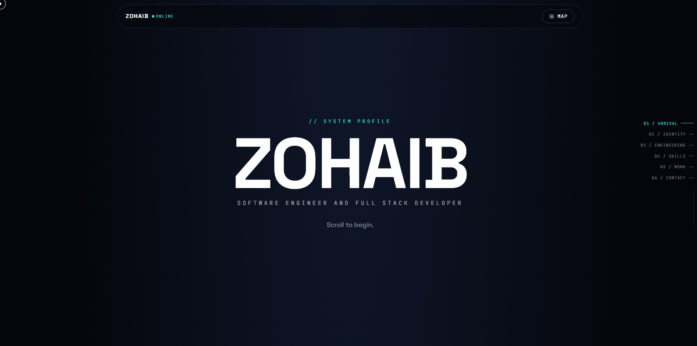

<div align="center">

# ZOHAIB — Portfolio


**A full-stack, MERN + TypeScript portfolio.** A scroll-driven 3D world instead of stacked
sections, a real Express/MongoDB API behind the contact form, blog, and project data, and an
admin panel to manage all of it without touching code.

[](https://github.com/zobbygit/zohaib-portfolio/actions/workflows/ci.yml)


[Live demo](#) · [Report a bug](../../issues) · [Deployment guide](./DEPLOYMENT.md)

</div>

---

## Contents

- [What this is](#what-this-is)
- [Highlights](#highlights)
- [Tech stack](#tech-stack)
- [Project structure](#project-structure)
- [Getting started](#getting-started)
- [Environment variables](#environment-variables)
- [API reference](#api-reference)
- [Admin panel](#admin-panel)
- [Testing](#testing)
- [CI/CD](#cicd)
- [Deployment](#deployment)
- [Security](#security)
- [Adding your own projects](#adding-your-own-projects)
- [Roadmap](#roadmap)
- [License](#license)

---

## What this is

Most developer portfolios are a stack of `<section>`s with a fade-in on scroll. This one is
built around a different idea: the homepage is **one continuous 3D world**, and scrolling
moves a camera through it — an arrival sequence, an identity chapter, an engineering-system
structure assembling itself, a technology constellation, and a project gateway — rather than
a series of disconnected blocks. Education, Journey, and the Lab get the same treatment on
their own routes. Underneath all of it is a real backend: validated, rate-limited, tested,
and driving an actual admin panel.

## Highlights

**Frontend**
- One continuous scroll-driven 3D world on the homepage (camera position is a direct function
  of scroll progress, not per-section fade-ins), plus dedicated 3D chapter-worlds on the
  Education, Journey, and Lab routes
- Project-specific 3D scenes (a different visual motif per project, not a generic template)
- A persistent custom cursor using `mix-blend-mode: difference` — it can't visually disappear
  into any background, light or dark
- A wipe-based route transition, including a shared-element-style animation when opening a
  project from its thumbnail
- Dark/light theme toggle, persisted
- Full SEO per route (title, description, canonical URL, Open Graph/Twitter tags) and an
  auto-generated sitemap
- Privacy-friendly page-view analytics (no cookies, no IPs stored) surfaced in the admin panel
- `prefers-reduced-motion` support site-wide: 3D and camera movement are replaced with a plain,
  fully accessible editorial layout
- WebGL feature-detected everywhere: every 3D scene has a real, non-broken fallback

**Backend**
- Express + TypeScript REST API, validated end-to-end with Zod
- JWT (httpOnly cookie) authentication for a single admin account
- Real-time layer via Socket.io (visitor presence + live contact-form events on the Lab page)
- Contact form emails sent server-side through EmailJS's REST API — the account keys never
  ship to the browser
- Helmet, a strict CORS allow-list, rate limiting (global + a stricter one on `/contact` and
  `/auth/login`), HTML sanitization, and centralized error handling that never leaks internals

**Tooling**
- Vitest + React Testing Library (frontend), Vitest + Supertest (backend)
- GitHub Actions: lint, typecheck, test, and production build for both apps on every push/PR
- Fully typed, `strict: true` on both sides, zero `any`

## Tech stack

| Layer | Technology |
| --- | --- |
| Frontend framework | React 18, TypeScript, Vite |
| Routing | React Router |
| Styling | Tailwind CSS |
| 3D | Three.js, React Three Fiber, drei |
| Motion / scroll | Lenis (smooth scroll), custom scroll-progress-driven camera rigs |
| Data fetching | TanStack Query, Axios |
| Forms & validation | React Hook Form, Zod |
| Real-time (client) | socket.io-client |
| SEO | react-helmet-async |
| Backend framework | Node.js, Express, TypeScript |
| Database | MongoDB, Mongoose |
| Auth | JWT (jsonwebtoken), bcryptjs |
| Real-time (server) | Socket.io |
| Security middleware | Helmet, CORS, express-rate-limit |
| Email | EmailJS REST API (server-side) |
| Testing | Vitest, React Testing Library, Supertest |
| CI/CD | GitHub Actions |
| Deployment | Vercel (frontend), Render (backend) |

## Project structure

```
zohaib-portfolio/
├── 📁 .github
│   └── 📁 workflows
│       └── ⚙️ ci.yml
├── 📁 backend
│   ├── 📁 src
│   │   ├── 📁 config
│   │   │   └── 📄 env.ts
│   │   ├── 📁 controllers
│   │   ├── 📁 middleware
│   │   │   ├── 📄 auth.ts
│   │   │   ├── 📄 errorHandler.ts
│   │   │   └── 📄 rateLimit.ts
│   │   ├── 📁 models
│   │   │   ├── 📄 Message.ts
│   │   │   ├── 📄 PageView.ts
│   │   │   ├── 📄 Post.ts
│   │   │   ├── 📄 Project.ts
│   │   │   └── 📄 User.ts
│   │   ├── 📁 realtime
│   │   │   └── 📄 socket.ts
│   │   ├── 📁 routes
│   │   │   ├── 📄 admin.ts
│   │   │   ├── 📄 analytics.ts
│   │   │   ├── 📄 auth.ts
│   │   │   ├── 📄 blog.ts
│   │   │   ├── 📄 contact.ts
│   │   │   ├── 📄 health.ts
│   │   │   └── 📄 projects.ts
│   │   ├── 📁 scripts
│   │   │   └── 📄 create-admin.ts
│   │   ├── 📁 services
│   │   │   ├── 📄 contact.service.ts
│   │   │   └── 📄 email.service.ts
│   │   ├── 📁 utils
│   │   │   ├── 📄 logger.ts
│   │   │   └── 📄 sanitize.ts
│   │   ├── 📁 validators
│   │   │   ├── 📄 admin.schema.ts
│   │   │   └── 📄 contact.schema.ts
│   │   ├── 📄 app.ts
│   │   └── 📄 server.ts
│   ├── 📁 tests
│   │   ├── 📄 analytics.test.ts
│   │   ├── 📄 auth.test.ts
│   │   ├── 📄 blog.test.ts
│   │   ├── 📄 contact.test.ts
│   │   ├── 📄 email.test.ts
│   │   ├── 📄 health.test.ts
│   │   ├── 📄 projects.test.ts
│   │   └── 📄 rateLimit.test.ts
│   ├── ⚙️ package-lock.json
│   ├── ⚙️ package.json
│   ├── ⚙️ render.yaml
│   ├── ⚙️ tsconfig.json
│   └── 📄 vitest.config.ts
├── 📁 frontend
│   ├── 📁 public
│   │   ├── 📁 projects
│   │   │   ├── 🖼️ agentforge.jpg
│   │   │   ├── 🖼️ connectra.jpg
│   │   │   ├── 🖼️ farmdrop.jpg
│   │   │   ├── 🖼️ skyport.jpg
│   │   │   ├── 🖼️ staycation.jpg
│   │   │   └── 🖼️ streamly.jpg
│   │   ├── 📄 _redirects
│   │   ├── 🖼️ portrait.jpg
│   │   ├── 📕 resume.pdf
│   │   └── 📄 robots.txt
│   ├── 📁 scripts
│   │   └── 📄 generate-sitemap.mjs
│   ├── 📁 src
│   │   ├── 📁 admin
│   │   │   ├── 📄 AuthContext.tsx
│   │   │   ├── 📄 RequireAdmin.test.tsx
│   │   │   └── 📄 RequireAdmin.tsx
│   │   ├── 📁 components
│   │   │   ├── 📁 scenes
│   │   │   │   ├── 📄 AgentForgeScene.tsx
│   │   │   │   ├── 📄 ConnectraScene.tsx
│   │   │   │   └── 📄 FarmDropScene.tsx
│   │   │   ├── 📁 world
│   │   │   │   ├── 📄 ArrivalMonolith.tsx
│   │   │   │   ├── 📄 CameraRig.tsx
│   │   │   │   ├── 📄 EducationWorld.tsx
│   │   │   │   ├── 📄 JourneyWorld.tsx
│   │   │   │   ├── 📄 LabWorld.tsx
│   │   │   │   ├── 📄 ProgressContext.tsx
│   │   │   │   ├── 📄 StoryProgress.tsx
│   │   │   │   ├── 📄 SystemPipeline.tsx
│   │   │   │   ├── 📄 WorkGateway.tsx
│   │   │   │   ├── 📄 WorkWorld.tsx
│   │   │   │   ├── 📄 WorldScene.tsx
│   │   │   │   └── 📄 chapters.ts
│   │   │   ├── 📄 ContactForm.test.tsx
│   │   │   ├── 📄 ContactForm.tsx
│   │   │   ├── 📄 Cursor.tsx
│   │   │   ├── 📄 Intro.tsx
│   │   │   ├── 📄 KineticPhrases.tsx
│   │   │   ├── 📄 MagneticButton.tsx
│   │   │   ├── 📄 Navbar.tsx
│   │   │   ├── 📄 Pipeline.tsx
│   │   │   ├── 📄 ProjectObject.tsx
│   │   │   ├── 📄 ProjectPreview.tsx
│   │   │   ├── 📄 Reveal.tsx
│   │   │   ├── 📄 RouteWipe.tsx
│   │   │   ├── 📄 Scene.tsx
│   │   │   ├── 📄 SectionHeading.tsx
│   │   │   ├── 📄 TechUniverse.tsx
│   │   │   ├── 📄 TechnicalSkills3D.tsx
│   │   │   ├── 📄 Testimonials.tsx
│   │   │   └── 📄 WorkGrid.tsx
│   │   ├── 📁 data
│   │   │   ├── 📄 content.ts
│   │   │   ├── 📄 navMap.ts
│   │   │   ├── 📄 profile.ts
│   │   │   ├── 📄 projects.ts
│   │   │   └── 📄 testimonials.ts
│   │   ├── 📁 hooks
│   │   │   ├── 📄 useInView.ts
│   │   │   └── 📄 useMediaQuery.ts
│   │   ├── 📁 lab
│   │   │   ├── 📄 AuthFlow.tsx
│   │   │   ├── 📄 DbRelations.tsx
│   │   │   ├── 📄 HttpDemo.tsx
│   │   │   ├── 📄 JsonExplorer.test.tsx
│   │   │   ├── 📄 JsonExplorer.tsx
│   │   │   ├── 📄 LiveActivity.tsx
│   │   │   ├── 📄 SocketDemo.tsx
│   │   │   └── 📄 SvgAnimation.tsx
│   │   ├── 📁 layout
│   │   │   └── 📄 SiteLayout.tsx
│   │   ├── 📁 lib
│   │   │   ├── 📄 ThemeContext.tsx
│   │   │   ├── 📄 analytics.ts
│   │   │   ├── 📄 api.ts
│   │   │   ├── 📄 homeScroll.ts
│   │   │   ├── 📄 reducedMotion.ts
│   │   │   ├── 📄 schemas.test.ts
│   │   │   ├── 📄 schemas.ts
│   │   │   ├── 📄 scrollProgress.ts
│   │   │   ├── 📄 seo.tsx
│   │   │   ├── 📄 sessionFlags.ts
│   │   │   └── 📄 transitionImage.ts
│   │   ├── 📁 pages
│   │   │   ├── 📁 admin
│   │   │   │   ├── 📄 AdminLayout.tsx
│   │   │   │   ├── 📄 AdminLoginPage.tsx
│   │   │   │   ├── 📄 AdminMessagesPage.tsx
│   │   │   │   ├── 📄 AdminOverviewPage.tsx
│   │   │   │   ├── 📄 AdminPostsPage.tsx
│   │   │   │   └── 📄 AdminProjectsPage.tsx
│   │   │   ├── 📄 AboutPage.tsx
│   │   │   ├── 📄 BlogPage.tsx
│   │   │   ├── 📄 BlogPostPage.tsx
│   │   │   ├── 📄 ContactPage.tsx
│   │   │   ├── 📄 EducationPage.tsx
│   │   │   ├── 📄 EngineeringPage.tsx
│   │   │   ├── 📄 HomePage.tsx
│   │   │   ├── 📄 JourneyPage.tsx
│   │   │   ├── 📄 LabPage.tsx
│   │   │   ├── 📄 NotFoundPage.test.tsx
│   │   │   ├── 📄 NotFoundPage.tsx
│   │   │   ├── 📄 ProjectPage.test.tsx
│   │   │   ├── 📄 ProjectPage.tsx
│   │   │   ├── 📄 ResumePage.tsx
│   │   │   ├── 📄 SkillsPage.test.tsx
│   │   │   ├── 📄 SkillsPage.tsx
│   │   │   └── 📄 WorkPage.tsx
│   │   ├── 📁 test
│   │   │   └── 📄 setup.ts
│   │   ├── 📁 types
│   │   │   └── 📄 index.ts
│   │   ├── 📄 App.tsx
│   │   ├── 🎨 index.css
│   │   ├── 📄 main.tsx
│   │   └── 📄 vite-env.d.ts
│   ├── 📄 eslint.config.js
│   ├── 🌐 index.html
│   ├── ⚙️ package-lock.json
│   ├── ⚙️ package.json
│   ├── 📄 postcss.config.js
│   ├── 📄 tailwind.config.js
│   ├── ⚙️ tsconfig.json
│   ├── ⚙️ vercel.json
│   └── 📄 vite.config.ts
├── ⚙️ .gitignore
├── 📝 DEPLOYMENT.md
├── 📝 README.md
└── 🖼️ image.png

```

## Getting started

**Prerequisites:** Node.js 20+, npm, and (optionally) a MongoDB connection string — the site
runs without one, falling back to static project data and skipping storage.

```bash
git clone https://github.com/zobbygit/zohaib-portfolio.git
cd zohaib-portfolio
```

**Backend:**

```bash
cd backend
cp .env.example .env      # fill in the values you have — all are optional except in production
npm install
npm run dev                # http://localhost:5000
```

**Frontend** (separate terminal):

```bash
cd frontend
cp .env.example .env
npm install
npm run dev                # http://localhost:5173
```

Open `http://localhost:5173`. Without a `MONGODB_URI`, the site still fully works — projects
come from the static fallback list, and the blog/contact-storage/admin panel simply have
nothing to show yet.

## Environment variables

**`backend/.env`** (see `backend/.env.example` for the annotated version):

| Variable | Required | Purpose |
| --- | --- | --- |
| `PORT` | no (default `5000`) | Port the API listens on |
| `NODE_ENV` | no | `development` / `test` / `production` |
| `CORS_ORIGINS` | yes | Comma-separated list of allowed frontend origins, no trailing slash |
| `MONGODB_URI` | no | Connection string. Unset → blog/storage/admin have no data, everything else still works |
| `CONTACT_RATE_LIMIT_PER_HOUR` | no (default `5`) | Submissions allowed per IP per hour |
| `JWT_SECRET` | **yes in production** (32+ chars) | Signs admin session cookies |
| `ADMIN_EMAIL` / `ADMIN_PASSWORD` | no | Only read by `npm run create-admin`, never by the running server |
| `EMAILJS_SERVICE_ID` / `EMAILJS_TEMPLATE_ID` / `EMAILJS_PUBLIC_KEY` / `EMAILJS_PRIVATE_KEY` | no | From your EmailJS account. Unset → the contact form validates and (if a database is connected) stores the message, and tells the visitor plainly that sending isn't configured yet, rather than faking success |

**`frontend/.env`** (public — anything prefixed `VITE_` ships to the browser by design, which
is exactly why the EmailJS keys above live in the backend instead):

| Variable | Required | Purpose |
| --- | --- | --- |
| `VITE_API_URL` | no (default `http://localhost:5000/api`) | Backend base URL |
| `VITE_SOCKET_URL` | no (default `http://localhost:5000`) | Backend URL for the Lab's live Socket.io connection |
| `VITE_SITE_URL` | no (default `http://localhost:5173`) | Used for SEO tags and the generated sitemap |

## API reference

Base URL: `{VITE_API_URL}` (default `http://localhost:5000/api`). Every response is JSON with
a `success: boolean` field; errors follow `{ success: false, error: string, details?: [...] }`.

### Public

| Method | Endpoint | Description |
| --- | --- | --- |
| `GET` | `/health` | Service status and database connection state |
| `GET` | `/projects` | All projects (empty array if no database is connected) |
| `GET` | `/blog` | Published blog posts, newest first |
| `GET` | `/blog/:slug` | A single published post, `404` if missing/unpublished |
| `POST` | `/contact` | Validates, stores (if DB connected), and emails a contact submission. Rate-limited per IP. Returns `{ emailSent, stored, reason? }` |
| `POST` | `/analytics/pageview` | Records one page view for a route path. No IP, cookie, or user agent stored |

### Auth

| Method | Endpoint | Description |
| --- | --- | --- |
| `POST` | `/auth/login` | `{ email, password }` → sets an httpOnly JWT cookie. Rate-limited (10 / 15 min) |
| `POST` | `/auth/logout` | Clears the session cookie |
| `GET` | `/auth/me` | `200` if the current cookie is a valid admin session, else `401` |

### Admin (all require the auth cookie above — `401` otherwise)

| Method | Endpoint | Description |
| --- | --- | --- |
| `GET` / `POST` | `/admin/projects` | List all / create a project |
| `PUT` / `DELETE` | `/admin/projects/:id` | Update / delete a project |
| `GET` / `POST` | `/admin/posts` | List all / create a blog post (draft or published) |
| `PUT` / `DELETE` | `/admin/posts/:id` | Update / delete a post |
| `GET` | `/admin/messages` | Contact-form inbox, newest first |
| `PATCH` | `/admin/messages/:id` | `{ read: boolean }` — mark read/unread |
| `DELETE` | `/admin/messages/:id` | Delete a message |
| `GET` | `/admin/analytics?days=30` | Page-view totals per route over the last *N* days |

### Real-time (Socket.io, not REST)

Connects at `{VITE_SOCKET_URL}` on path `/socket.io`. Events: `presence` (`{ online }`),
`activity` (`{ type: "contact.received", at }`), `heartbeat` (every 15s). No personal data is
ever sent over the socket.

## Admin panel

A single-admin dashboard at `/admin`, guarded by the JWT cookie above.

```bash
cd backend
ADMIN_EMAIL=you@example.com ADMIN_PASSWORD='a long passphrase' MONGODB_URI='...' npm run create-admin
```

Then sign in at `/admin/login`. From there:

- **Overview** — page-view analytics for the last 30 days
- **Projects** — create/edit/delete case studies without touching code
- **Blog posts** — create/edit/delete, publish or keep as drafts
- **Messages** — read the contact-form inbox, mark read/unread, reply by email, delete

## Testing

```bash
cd frontend && npm test    # Vitest + React Testing Library
cd backend  && npm test    # Vitest + Supertest
```

Coverage includes: form validation and submission states, the JSON-explorer and 404 pages,
the admin route guard, honeypot/CORS/malformed-JSON handling, and the contact/auth/analytics
endpoints — including the case where no database is connected at all.

## CI/CD

`.github/workflows/ci.yml` runs on every push and pull request to `main`, as two independent
jobs (frontend, backend), each: `npm ci` → lint/typecheck → test → production build. A red
check on either job means that app doesn't build cleanly — nothing is deployed automatically
from here; see below for that.

## Deployment

**Frontend on Vercel, backend on Render — not both on Vercel.** This backend holds a
persistent Socket.io connection and a long-lived MongoDB connection, neither of which survive
Vercel's short-lived serverless functions. Render (or Railway/Fly.io) runs it as a normal
always-on Node process instead.

Full walkthrough — MongoDB Atlas → Render → Vercel → verifying it worked — is in
**[`DEPLOYMENT.md`](./DEPLOYMENT.md)**. `backend/render.yaml` is a Render Blueprint that
scaffolds the backend service and lists every environment variable it needs.

## Security

Defense in depth, not a guarantee: Helmet security headers, a strict CORS allow-list, a 16KB
JSON body limit, rate limiting (global + stricter on contact/login), Zod validation on every
request body, HTML/control-character stripping on free-text fields, a honeypot field on the
contact form, bcrypt password hashing, httpOnly/sameSite=strict JWT cookies, timing-safe login
comparisons, and centralized error handling that never leaks stack traces. EmailJS credentials
and the JWT secret live only in the backend's environment, never in the frontend bundle.

## Adding your own projects

Two ways, depending on setup:

1. **No database yet:** edit `frontend/src/data/projects.ts` directly (copy an existing entry
   as a template) and drop a screenshot in `frontend/public/projects/`. No rebuild logic beyond
   a normal redeploy.
2. **Database connected:** use the admin panel (`/admin/projects`) — no code changes, live
   immediately. The public site prefers whatever's in the database over the static file
   automatically.

## Roadmap

Honestly tracking what's next, not just what's done:

- [ ] Full page-level light/dark theming (currently covers shared chrome — nav, background,
      transitions — not every page's content colors)
- [ ] GSAP ScrollTrigger-based pinning as an alternative to the current direct
      scroll-progress-driven camera approach
- [ ] Multilingual support (not currently planned)
- [ ] Real testimonials (the section exists and stays hidden until real ones are added —
      no placeholder or invented quotes ship in this repo)

## License

MIT — see [`LICENSE`](./LICENSE) if present, or treat this repo as MIT-licensed by default.
Project screenshots, resume content, and personal copy are **not** covered by that license —
those are Zohaib's own content.

---

<div align="center">

Built by **Zohaib Aslam** — [GitHub](https://github.com/zobbygit) ·
[Portfolio](https://zohaib-portfolio-eta-seven.vercel.app) 

</div>
